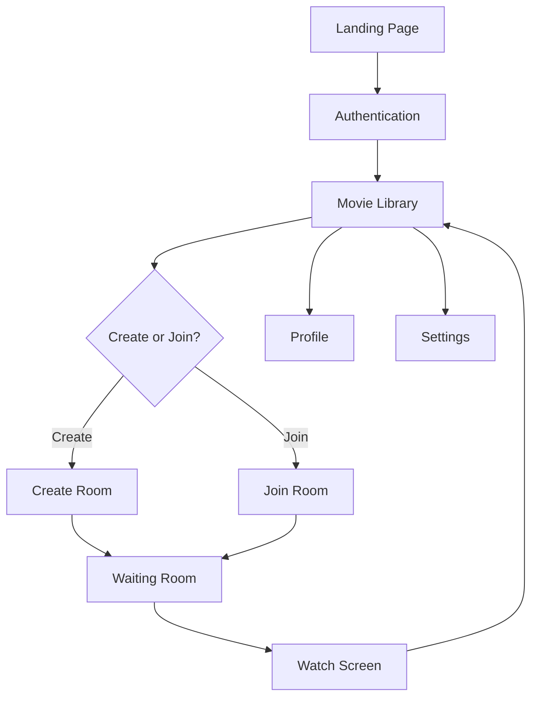

# ConnectUS - Complete Project Analysis

## Executive Summary

**ConnectUS** is a modern web application for synchronized movie watching with friends. It enables users to stream movies together in real-time with integrated video chat, live reactions, and synchronized playback controls. The application is built with Next.js 16, React 19, TypeScript, and Tailwind CSS, featuring a premium dark-mode design with glassmorphism effects and smooth animations.

---

## 🎯 Project Overview

### Purpose
ConnectUS allows users to:
- Watch movies together remotely with perfect synchronization
- Video chat with friends while watching
- Share reactions in real-time
- Chat during the movie
- Create custom-themed watch rooms

### Tech Stack

#### Core Framework
- **Next.js 16.0.3** - React framework with App Router
- **React 19.2.0** - UI library
- **TypeScript 5** - Type safety
- **Tailwind CSS 4** - Styling framework

#### UI Components & Libraries
- **Radix UI** - Comprehensive component library (17+ components)
- **Framer Motion 12.23.24** - Animation library
- **Lucide React** - Icon library
- **Shadcn/ui** - Component patterns (48 UI components)

#### Additional Libraries
- **next-themes** - Theme management
- **react-hook-form** - Form handling
- **sonner** - Toast notifications
- **recharts** - Data visualization
- **embla-carousel-react** - Carousel functionality
- **cmdk** - Command palette
- **vaul** - Drawer component

---

## 📁 Project Structure

```
ConnectUS/
├── src/
│   ├── app/                    # Next.js App Router pages
│   │   ├── auth/              # Authentication page
│   │   ├── create-room/       # Room creation page
│   │   ├── join-room/         # Join room page
│   │   ├── library/           # Movie library page
│   │   ├── profile/           # User profile page
│   │   ├── settings/          # Settings page
│   │   ├── waiting-room/      # Pre-watch waiting area
│   │   ├── watch/             # Movie watching screen
│   │   ├── layout.tsx         # Root layout
│   │   ├── page.tsx           # Landing page route
│   │   └── globals.css        # Global styles
│   │
│   ├── components/            # React components
│   │   ├── Authentication.tsx
│   │   ├── CreateRoom.tsx
│   │   ├── JoinRoom.tsx
│   │   ├── LandingPage.tsx
│   │   ├── MovieLibrary.tsx
│   │   ├── MovieWatchScreen.tsx
│   │   ├── Profile.tsx
│   │   ├── Settings.tsx
│   │   ├── WaitingRoom.tsx
│   │   ├── figma/            # Figma-related components
│   │   │   └── ImageWithFallback.tsx
│   │   └── ui/               # 48 Shadcn UI components
│   │       ├── button.tsx
│   │       ├── input.tsx
│   │       ├── dialog.tsx
│   │       └── ... (45 more)
│   │
│   ├── App.tsx               # Legacy app component
│   └── styles/               # Additional styles
│
├── public/                   # Static assets
│   ├── file.svg
│   ├── globe.svg
│   ├── next.svg
│   ├── vercel.svg
│   └── window.svg
│
├── guidelines/
│   └── Guidelines.md        # Development guidelines
│
├── package.json
├── tsconfig.json
├── next.config.ts
├── tailwind.config.js
├── postcss.config.mjs
├── eslint.config.mjs
└── updateofhewatchroom.md   # Watch room update documentation
```

---

## 🎨 Application Flow

### Screen Navigation

The application uses a screen-based navigation system with the following screens:

1. **Landing** (`/`) - Marketing page with features, pricing
2. **Auth** (`/auth`) - Sign in/Sign up
3. **Library** (`/library`) - Browse and select movies
4. **Create Room** (`/create-room`) - Configure watch room
5. **Join Room** (`/join-room`) - Join existing room via code
6. **Waiting Room** (`/waiting-room`) - Pre-watch lobby
7. **Watch** (`/watch`) - Main viewing experience
8. **Profile** (`/profile`) - User profile management
9. **Settings** (`/settings`) - App settings



---

## 🎬 Core Features Analysis

### 1. Landing Page
**File:** `src/components/LandingPage.tsx`

**Features:**
- Hero section with gradient text effects
- Animated floating cards
- Features showcase (Perfect Sync, Video Calls, Any Platform)
- How it works (3-step process)
- Pricing tiers (Free, Pro, Team)
- Smooth scroll navigation
- Responsive design

**Design Elements:**
- Purple gradient theme (#695CFF to #8B7FFF)
- Glassmorphism effects
- Framer Motion animations
- Dark background (#0D0D0F)

### 2. Authentication
**File:** `src/components/Authentication.tsx`

**Features:**
- Toggle between Sign In/Sign Up
- Email/password authentication
- Social login (Google, Apple)
- Forgot password flow
- Split-screen design with gradient illustration

**Form Fields:**
- Full name (sign up only)
- Email address
- Password

### 3. Movie Library
**File:** `src/components/MovieLibrary.tsx`

**Features:**
- Movie grid display
- Category filtering (All, Action, Drama, Sci‑Fi, Comedy, Thriller)
- Search functionality
- Movie cards with poster, title, duration, rating, genre
- Navigation to create/join room
- Profile and settings access

**Sample Movies:**
- Quantum Horizon (Sci‑Fi)
- Neon Dreams (Action)
- The Last Echo (Drama)
- Silent Echo (Thriller)
- Midnight Run (Action)
- City Lights (Comedy)

### 4. Create Room
**File:** `src/components/CreateRoom.tsx`

**Features:**
- Room name input
- Privacy settings (Public/Private)
- Movie carousel selection
- Theme customization (7 themes): Purple Dream, Ocean Blue, Sunset Orange, Forest Green, Rose Pink, Midnight Black, Golden Hour
- Participant limit setting
- Start time scheduling
- Auto‑start toggle

### 5. Waiting Room
**File:** `src/components/WaitingRoom.tsx`

**Features:**
- Room code display with copy functionality
- Participant list with online status
- Video/mic preview controls
- Movie information display
- Start watching button (host only)
- Themed UI based on room settings

### 6. Movie Watch Screen
**File:** `src/components/MovieWatchScreen.tsx` (also in `updateofhewatchroom.md`)

**Features:**
#### Video Player
- HTML5 video element
- Play/pause controls
- Volume slider & mute
- Seek bar with progress
- Skip forward/backward (10 s)
- Time display (current/total)
- Fullscreen support
- Auto‑hide controls after 3 s

#### Social Features
- Video chat (3 participant feeds)
- Live chat sidebar
- Floating emoji reactions (heart, thumbs‑up, laugh)

#### Controls Bar (Bottom)
- Participant count
- Mic toggle
- Video toggle
- End call button

#### UI Features
- Theme‑driven colors, glassmorphism, smooth animations, responsive layout, chat toggle

### 7. Profile & Settings
**Files:** `src/components/Profile.tsx`, `src/components/Settings.tsx`

Basic user management screens (implementation details not fully visible).

---

## 🎨 Design System

### Color Palette
#### Primary Theme
- **Primary:** `#695CFF` (Purple)
- **Secondary:** `#8B7FFF` (Light Purple)
- **Background:** `#0D0D0F` (Near Black)
- **Foreground:** White/Light colors

#### CSS Variables (Dark Mode)
```css
--background: oklch(0.145 0 0);
--foreground: oklch(0.985 0 0);
--primary: oklch(0.985 0 0);
--secondary: oklch(0.269 0 0);
--muted: oklch(0.269 0 0);
--accent: oklch(0.269 0 0);
--border: oklch(0.269 0 0);
```

### Typography
- **Font Family:** Geist Sans, Geist Mono
- **Base Size:** 16 px
- **Weights:** 400 (normal), 500 (medium)

### Design Patterns
- **Glassmorphism:** `backdrop-blur-xl`, `bg-white/10`
- **Rounded Corners:** `rounded-2xl`, `rounded-3xl`, `rounded-full`
- **Gradients:** `from-[#695CFF] to-[#8B7FFF]`
- **Borders:** `border-white/10`, `border-white/20`
- **Shadows:** Subtle box shadows for depth

### Custom Scrollbar
- Width: 8 px
- Track: `rgba(255,255,255,0.05)`
- Thumb: `rgba(255,255,255,0.2)`
- Hover: `rgba(255,255,255,0.3)`

---

## 🔧 Technical Implementation

### State Management
Uses React hooks (`useState`, `useRef`, `useEffect`). No global state library detected.

**Key State:**
- `currentScreen` – navigation state
- `isAuthenticated` – auth status
- `selectedMovie` – current movie selection
- `roomTheme` – room customization
- Video player state (playing, volume, time, etc.)

### Routing
- **Next.js App Router** – file‑based routing
- **Client‑side navigation** – `useRouter` hook
- **Screen mapping** – custom navigation function

### Data Models
#### Movie Interface
```typescript
interface Movie {
  id: number;
  title: string;
  image: string;
  duration: string;
  rating: string;
  genre: string;
  videoUrl?: string;
}
```
#### RoomTheme Interface
```typescript
interface RoomTheme {
  primary: string;
  secondary: string;
  name: string;
}
```

### Video Integration
- Sample videos from Google Cloud Storage
- HTML5 video API with custom overlay controls
- Fullscreen API integration

---

## 📦 Dependencies Analysis

### Production Dependencies (56 packages)
#### UI Components (Radix UI – 26 packages)
- Accordion, Alert Dialog, Avatar, Checkbox, Dialog, Dropdown Menu, Hover Card, Label, Menubar, Navigation Menu, Popover, Progress, Radio Group, Scroll Area, Select, Separator, Slider, Switch, Tabs, Toggle, Tooltip, …

#### Styling
- `tailwindcss` v4
- `tailwind-merge`
- `class-variance-authority`
- `clsx`

#### Animation
- `framer-motion` v12.23.24

#### Forms & Validation
- `react-hook-form` v7.66.1
- `input-otp`

#### UI Utilities
- `embla-carousel-react`
- `cmdk`
- `vaul`
- `sonner`
- `recharts`
- `react-day-picker`
- `react-resizable-panels`

#### Icons
- `lucide-react` v0.554.0

#### Theming
- `next-themes` v0.4.6

### Dev Dependencies (7 packages)
- `@types/node`, `@types/react`, `@types/react-dom`
- `typescript` v5
- `eslint` v9 + `eslint-config-next`
- `babel-plugin-react-compiler`
- `@tailwindcss/postcss` v4

---

## 🎯 Key Features Summary

### ✅ Implemented
1. Landing page with marketing content
2. Authentication UI (sign‑in / sign‑up)
3. Movie library with filtering
4. Room creation with customization
5. Room joining flow
6. Waiting room with participants
7. Video player with controls
8. Live chat interface
9. Reaction system
10. Video‑call UI (participant feeds)
11. Theme customization
12. Responsive design
13. Dark mode

### ⚠️ Frontend Only (No Backend)
- No real authentication (UI only)
- No database integration
- No real‑time synchronization
- No actual video chat (WebRTC not implemented)
- No room persistence
- Sample/mock data only

### 🔴 Missing / Incomplete
1. Backend API
2. Database (users, rooms, movies)
3. Real‑time sync (WebSockets / WebRTC)
4. Video chat implementation
5. Movie streaming integration
6. Payment processing (for pricing tiers)
7. User profile functionality
8. Settings functionality
9. Search implementation
10. Category filtering logic

---

## 🏗️ Architecture Patterns

### Component Structure
- **Presentational Components:** UI‑focused, receive props
- **Container Pattern:** Page components manage state
- **Composition:** Radix UI primitives composed into custom components

### File Organization
- **Co‑location:** Components in `/components`
- **Route‑based:** Pages in `/app` directory
- **UI Library:** Reusable components in `/components/ui`

### Styling Approach
- **Utility‑first:** Tailwind CSS classes
- **Component variants:** `class-variance-authority`
- **CSS Variables:** Theme tokens in `globals.css`
- **Inline styles:** Dynamic theme colors

---

## 🎨 Design Highlights

### Visual Excellence
1. Glassmorphism – frosted glass effects throughout
2. Gradients – purple‑based color schemes
3. Animations – smooth Framer Motion transitions
4. Micro‑interactions – hover effects, scale transforms
5. Typography – clean, modern font choices
6. Spacing – generous padding and margins
7. Depth – layered UI with backdrop blur

### User Experience
1. Smooth navigation – animated page transitions
2. Visual feedback – loading states, hover effects
3. Accessibility – Radix UI primitives (ARIA compliant)
4. Responsive – mobile‑friendly layouts
5. Dark mode – eye‑friendly dark theme
6. Intuitive flow – clear user journey

---

## 📝 Code Quality

### Strengths
- ✅ TypeScript for type safety
- ✅ Component‑based architecture
- ✅ Consistent naming conventions
- ✅ Modern React patterns (hooks)
- ✅ Accessible components (Radix UI)
- ✅ ESLint configuration
- ✅ Clean file structure

### Areas for Improvement
- ⚠️ No testing setup (Jest, React Testing Library)
- ⚠️ No API layer/services
- ⚠️ No error boundaries
- ⚠️ No loading states for async operations
- ⚠️ Hard‑coded mock data
- ⚠️ No environment variables for configuration
- ⚠️ Limited error handling
- ⚠️ No form validation logic

---

## 🚀 Deployment & Build

### Scripts
```json
{
  "dev": "next dev",
  "build": "next build",
  "start": "next start",
  "lint": "eslint"
}
```

### Build Configuration
- **Next.js Config:** `next.config.ts` (minimal configuration)
- **TypeScript:** `tsconfig.json` (strict mode enabled)
- **PostCSS:** Tailwind CSS processing
- **ESLint:** Next.js recommended rules

---

## 🔮 Future Enhancements

### Backend Integration
1. User authentication (JWT, OAuth)
2. Database (PostgreSQL, MongoDB)
3. REST API or GraphQL
4. Real‑time sync (Socket.io, Pusher)
5. Video chat (WebRTC, Agora, Twilio)

### Features
1. Movie API integration (TMDB, OMDB)
2. Streaming service connections
3. Room persistence
4. User profiles with watch history
5. Friend system
6. Notifications
7. Mobile app (React Native)
8. Screen sharing
9. Playlist creation
10. Watch‑party scheduling

### Technical Improvements
1. Unit and integration tests
2. E2E testing (Playwright, Cypress)
3. Performance optimization
4. SEO optimization
5. Analytics integration
6. Error tracking (Sentry)
7. CDN for assets
8. Progressive Web App (PWA)

---

## 📊 Project Metrics
- **Total Components:** 58+ (9 page components + 48 UI components + figma)
- **Total Pages:** 9 screens
- **Dependencies:** 56 production + 7 dev
- **Lines of Code:** ~15,000+ (estimated)
- **TypeScript Coverage:** 100%
- **Framework:** Next.js 16 (latest)
- **React Version:** 19.2.0 (latest)

---

## 🎓 Learning Resources
The project demonstrates:
- Next.js App Router patterns
- React 19 features
- TypeScript best practices
- Tailwind CSS v4 usage
- Framer Motion animations
- Radix UI component composition
- Modern web design trends
- Glassmorphism effects
- Video player implementation
- Real‑time UI patterns

---

## 📄 Documentation Files
1. **README.md** – Standard Next.js boilerplate
2. **Guidelines.md** – Development guidelines (mostly template)
3. **Attributions.md** – Asset attributions
4. **updateofhewatchroom.md** – Watch room component code

---

## 📡 API Endpoints
Below is a concise specification of the REST‑style endpoints the backend should expose. All endpoints assume JWT Bearer authentication where noted.

### 1️⃣ Authentication & Account Management
| Method | Endpoint | Purpose | Request Body | Response |
|--------|----------|---------|--------------|----------|
| **POST** | `/api/auth/register` | Create a new user | `{ email, password, fullName? }` | `{ userId, token, expiresAt }` |
| **POST** | `/api/auth/login` | Sign‑in existing user | `{ email, password }` | `{ userId, token, expiresAt }` |
| **POST** | `/api/auth/logout` | Invalidate token (optional) | – | `{ success: true }` |
| **POST** | `/api/auth/forgot-password` | Send reset email | `{ email }` | `{ success: true }` |
| **POST** | `/api/auth/reset-password/:resetToken` | Reset password | `{ newPassword }` | `{ success: true }` |
| **GET** | `/api/auth/me` | Get current profile (auth‑required) | – | `{ userId, email, fullName, avatarUrl, … }` |
| **PATCH** | `/api/auth/me` | Update profile | `{ fullName?, avatarUrl?, … }` | Updated user object |

### 2️⃣ Movies (Library)
| Method | Endpoint | Purpose | Request Body | Response |
|--------|----------|---------|--------------|----------|
| **GET** | `/api/movies` | List movies (pagination, search, filter) | Query: `page`, `limit`, `search`, `genre`, `sort` | `{ items: [Movie], total, page, limit }` |
| **GET** | `/api/movies/:id` | Get single movie details | – | `Movie` |
| **POST** | `/api/movies` *(admin)* | Add new movie | `{ title, image, videoUrl, duration, rating, genre }` | Created `Movie` |
| **PATCH** | `/api/movies/:id` *(admin)* | Update movie | Partial fields | Updated `Movie` |
| **DELETE** | `/api/movies/:id` *(admin)* | Remove movie | – | `{ success: true }` |

### 3️⃣ Rooms (Watch‑Party Management)
| Method | Endpoint | Purpose | Request Body | Response |
|--------|----------|---------|--------------|----------|
| **POST** | `/api/rooms` | Create a room | `{ name, isPrivate, themeId, maxParticipants, startTime?, autoStart?, movieId }` | `{ roomId, code, hostUserId, … }` |
| **GET** | `/api/rooms/:code` | Get room by public join code | – | `Room` (participants, theme, movie, status) |
| **GET** | `/api/rooms/:roomId` | Get room (auth‑required, host only) | – | `Room` |
| **PATCH** | `/api/rooms/:roomId` | Update mutable fields | Partial room fields | Updated `Room` |
| **DELETE** | `/api/rooms/:roomId` | Delete/cancel room (host) | – | `{ success: true }` |
| **POST** | `/api/rooms/:roomId/participants` | Join a room (via code) | `{ userId, displayName, avatar }` | Updated participants list |
| **DELETE** | `/api/rooms/:roomId/participants/:userId` | Leave a room | – | Updated participants list |
| **GET** | `/api/rooms/:roomId/status` | Poll current status (optional) | – | `{ isLive, currentTime, isPlaying, … }` |

### 4️⃣ Real‑Time Sync & Collaboration (WebSocket)
Typical Socket.io events (channel: `ws://api.connectus.com/rooms/:roomId`):
- `join` – client → server `{ userId, displayName, avatar }`
- `leave` – client → server
- `play`, `pause`, `seek` – host controls `{ currentTime }`
- `volume` – host volume change `{ volume, muted }`
- `reaction` – `{ type, userId }`
- `chatMessage` – `{ userId, text, timestamp }`
- `videoSignal` – WebRTC SDP/ICE exchange
- `roomUpdate` – server → all (participants, theme, etc.)
- `syncState` – periodic server → all `{ isPlaying, currentTime, volume, muted }`

### 5️⃣ Chat & Reactions (Persisted)
| Method | Endpoint | Purpose |
|--------|----------|---------|
| **GET** | `/api/rooms/:roomId/chat` | Fetch recent chat messages (pagination) |
| **POST** | `/api/rooms/:roomId/chat` | Persist a new message (also emitted via WS) |
| **GET** | `/api/rooms/:roomId/reactions` | Load recent reactions |
| **POST** | `/api/rooms/:roomId/reactions` | Add a reaction (also emitted via WS) |

### 6️⃣ Pricing / Payments (Optional)
| Method | Endpoint | Purpose |
|--------|----------|---------|
| **GET** | `/api/plans` | List subscription tiers |
| **POST** | `/api/payments/checkout` | Create checkout session (Stripe, etc.) |
| **POST** | `/api/payments/webhook` | Receive payment callbacks |
| **GET** | `/api/account/subscription` | Get current user plan |
| **PATCH** | `/api/account/subscription` | Upgrade / downgrade plan |

### 7️⃣ Miscellaneous
| Method | Endpoint | Purpose |
|--------|----------|---------|
| **GET** | `/api/themes` | Return predefined room themes (primary/secondary colors, name) |
| **GET** | `/api/health` | Simple health‑check for load balancers |
| **GET** | `/api/version` | Return API version / build info |

---

## 📡 Conclusion
ConnectUS is a **well‑designed, modern frontend application** showcasing excellent UI/UX, a premium design system, and a clear component architecture. The next logical step is to build the backend outlined above, enabling real‑time synchronization, persistent rooms, authentication, and video‑chat capabilities.

**Current State:** Frontend prototype/MVP with mock data.

**Next Steps:** Implement the API endpoints, add a database, wire up WebSocket sync, and integrate a streaming provider.

**Ideal For:** Portfolio showcase, learning modern full‑stack development, or a foundation for a production‑grade watch‑party platform.

**Production Ready:** No – backend, authentication, and real‑time sync are still required.

---

*Generated by Antigravity – your AI coding assistant.*
